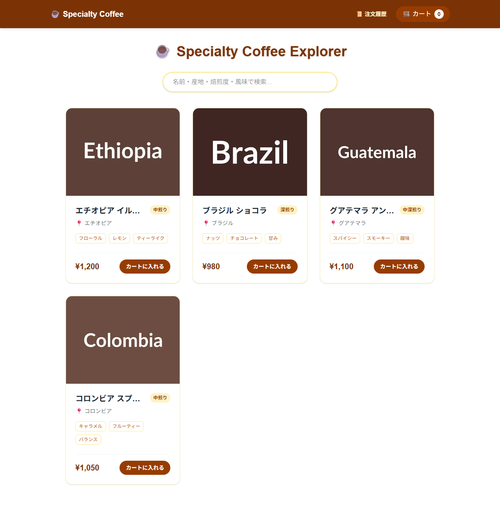

# ☕ Specialty Coffee Explorer

Next.js (App Router) と Prisma を活用した、型安全でモダンなフルスタックECアプリケーションです。
Java/Scala エンジニアとしての設計思想を、TypeScript のエコシステムで表現しました。

## 🌟 主な機能
- **商品一覧・検索**: 商品は PostgreSQL に保存。名前・産地・焙煎度・風味タグをサーバー側で検索（URL の `?q=` と連動、入力 300ms デバウンス）。
- **商品詳細**: 動的ルーティングによる DB 参照の詳細表示。
- **カート機能**: Zustand を活用した、ページを跨いでも保持される状態管理。
- **注文処理**: Server Actions で DB（PostgreSQL）に保存。クライアントからは商品 ID のみ受け取り、価格・合計金額はサーバー側で DB から確定（価格改ざん対策）。
- **ローディング・エラー制御**: `loading.tsx` や `not-found.tsx` による一貫したユーザー体験。

## 🧠 設計のポイント
- **価格をクライアントから信用しない**: `processCheckout(productIds)` は ID だけを受け取り、`Product` テーブルから価格を引き直して `Order` / `OrderItem` を 1 回の `create`（ネスト書き込み）で保存します。
- **注文明細は購入時点のスナップショット**: `OrderItem` に商品名・価格をコピーして保持し、後から商品価格が変わっても過去の注文が変わりません。
- **Server Component + Prisma**: 一覧・詳細ページはサーバーで直接 DB を読み、`Search` のみクライアントコンポーネントにしています。
- **型の一元化**: `lib/types.ts` の `CoffeeBean` 型は Prisma の `Product` と同形です。

## 🛠️ 技術スタック
- **Frontend**: Next.js 16 (App Router), React 19, Tailwind CSS 4, Zustand
- **Backend**: Next.js Server Actions, Zod (バリデーション)
- **Database**: PostgreSQL (Neon), Prisma (ORM)
- **Deployment**: Vercel

## 📂 フォルダ構造の解説
- `actions/`: ビジネスロジック（注文処理など）
- `app/`: ルーティングと UI コンポーネント
- `components/`: 再利用可能な UI パーツ
- `lib/`: Prisma クライアント、商品取得クエリ（`products.ts`）、型・スキーマ
- `prisma/`: スキーマと初期データ（`seed.ts`）
- `store/`: グローバルな状態管理

## 🚀 ローカル開発手順
0. （Vercel では `npm run build` 時に db push とシードが自動実行されます）
1. 依存関係のインストール: `npm install`
2. `.env` に `DATABASE_URL`（Neon などの PostgreSQL 接続文字列）を設定
3. データベース同期: `npm run db:push`
4. 商品の初期データ投入: `npm run db:seed`
5. 開発サーバー起動: `npm run dev`

